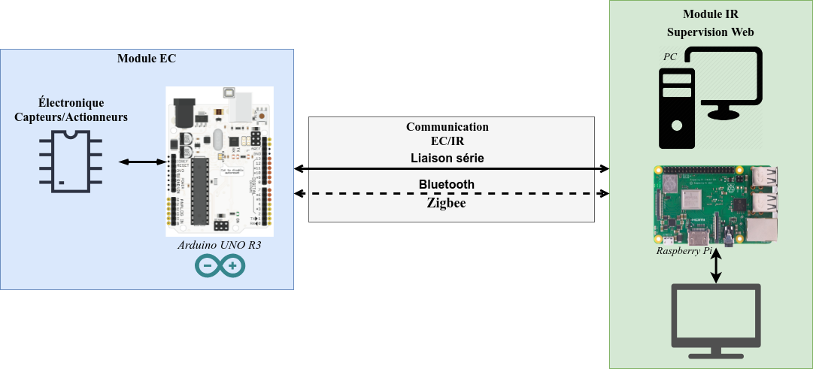
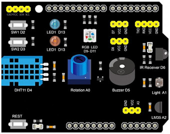

\mainpage Présentation

Il s'agit de réaliser un simulateur pour un exemple de mini-projet de première année de BTS SN.

Le simulateur présenté est basé sur un Arduino UNO R3 et un _shield_ :



La partie électronique sera remplacée par un _shield_ :



Le _shield_ fournira deux sous-modules :

- une **sonde** DHT11 permettant d'obtenir la température en °C et l'humidité en %
- une led rouge permettant de signaler l'activation ou non du **chauffage**

Les fonctions réalisées par ce module sont :

- d'acquérir les données de la sonde DHT11 (température en °C et humidité en %)
- de commander la led rouge
- de dialoguer avec l'application web

## PlatformIO

```ini
; PlatformIO Project Configuration File
; https://docs.platformio.org/page/projectconf.html

[env:uno]
platform = atmelavr
board = uno ; mcu : atmega328p
framework = arduino
lib_deps =
    Adafruit Unified Sensor
	DHT sensor library
; pour linux
upload_port = /dev/ttyACM0
upload_speed = 115200 ; par défaut
monitor_port = /dev/ttyACM0
monitor_speed = 9600 ; à définir
```

## Communication série

L'application web communique avec le module électronique via une liaison série.

La liaison sera soit filaire (RS232 ou TTL) soit sans fil (Bluetooth, Zigbee). Dans tous les cas, une communication série sera à mettre en oeuvre via une interface de communication.

### Port série virtuel

L'interface de communication côté EC sera gérée par un objet de type `SoftwareSerial` :

```cpp
// Broches utilisées :
//  - RX -> D7
//  - TX -> D8
SoftwareSerial liaisonSerie(RX, TX);
```

Lien : https://www.arduino.cc/en/Reference/softwareSerial


### Protocole

Le choix se fera entre un protocole orienté caractères ASCII ou orienté bits.

> Les protocoles orientés ASCII transmettent les octets sous la forme de caractères (encodés dans le jeu standard le plus souvent). Cette technique est très majoritairement utilisée pour les protocoles Internet de la couche Application (HTTP, FTP, SMTP, ...) mais aussi sur des réseaux de terrain (protocole NMEA183 ou commandes AT par exemple). Les protocoles orientés ASCII ont l'avantage de s'affranchir de la problématique de la représentation et la taille des données binaires (endianness dûs à un parc de machines hétérogène). Il existe tout de même des protocoles spécifique pour transmettre des données numériques (comme le protocole XDR (_eXternal Data Representation_)). Pour les données binaires (images, archive, ...), on utilise un encodage comme la Base64. L'inconvénient principal est de génèrer plus de d’octets mais la taille des données utiles (_payload_) et les débits sont relativement importants dans les réseaux informatiques.

Ici, le protocole mis en oeuvre est orienté caractères ASCII.

Les délimiteurs sont :

- délimiteur de début : `$`
- délimiteur de champs : `;`
- délimiteur de début : `\r\n`

Exemple de trames :

```
# Trame de requête
$GET;SONDE\r\n

# Trame de réponse
$SONDE;23.0;C;38;%\r\n

# Trames de commande
$SET;CHAUFFAGE;ON\r\n
$SET;CHAUFFAGE;OFF\r\n
```

\author Thierry Vaira <<tvaira@free.fr>>
\date 22/11/2021
\version 0.1

\page page_about A propos

\author Thierry Vaira <<tvaira@free.fr>>
\date 22/11/2021
\version 0.1
