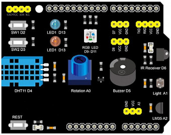
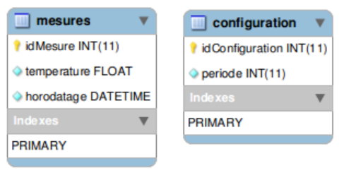
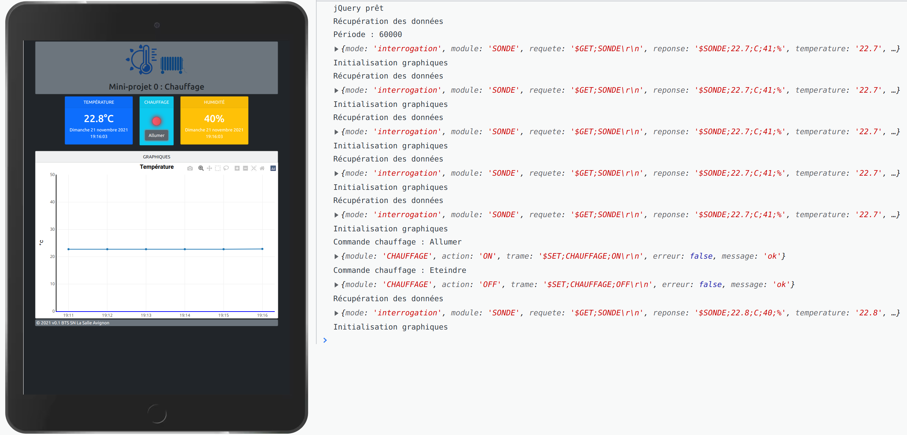
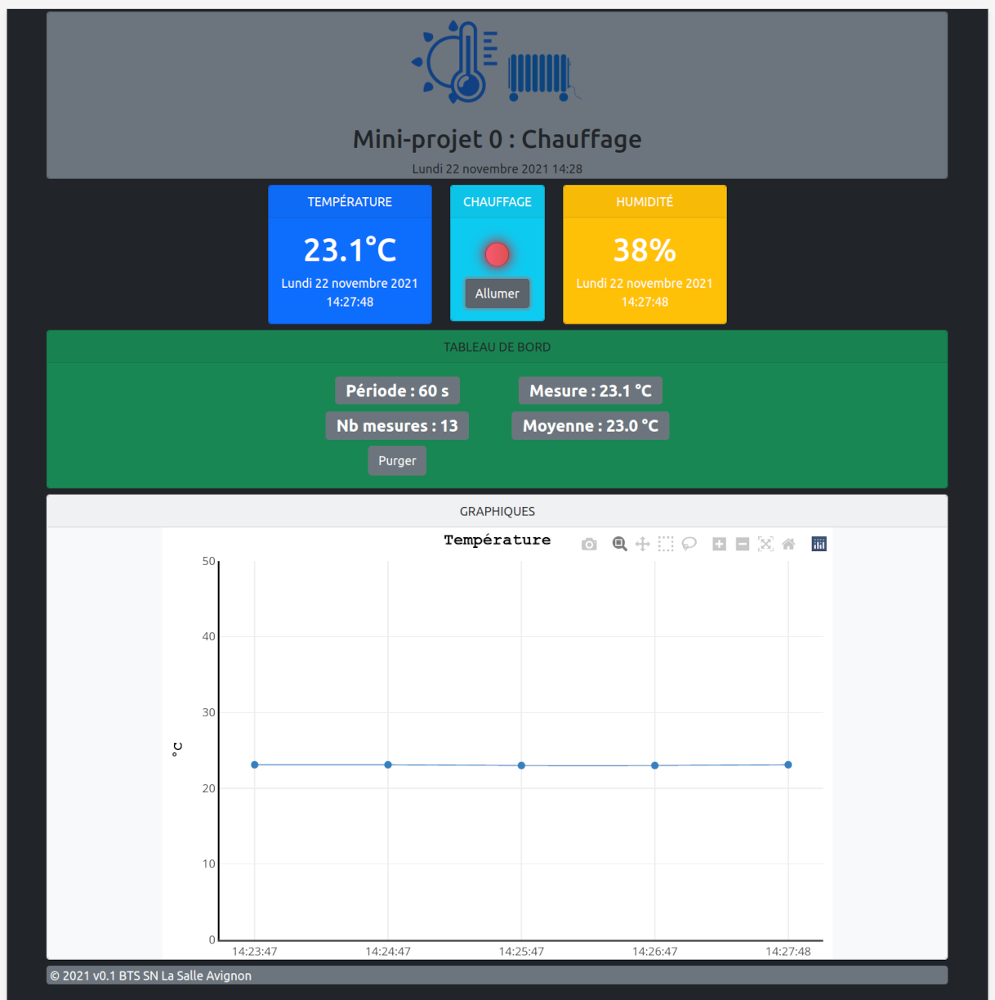
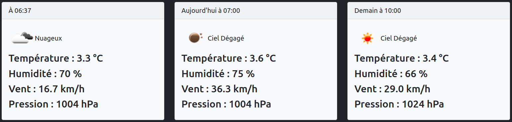

# Partie IR

- [Partie IR](#partie-ir)
  - [Présentation](#présentation)
  - [Objectifs](#objectifs)
  - [Partie Web](#partie-web)
    - [Pré-requis](#pré-requis)
    - [Serveur web](#serveur-web)
    - [Arborescence](#arborescence)
    - [Extensions](#extensions)
    - [Ajax](#ajax)
    - [PHP](#php)
    - [Exigences](#exigences)
  - [Partie Base de données](#partie-base-de-données)
    - [Exemple](#exemple)
    - [Exigences](#exigences-1)
  - [Communication série](#communication-série)
    - [Port série virtuel](#port-série-virtuel)
    - [Protocole](#protocole)
  - [Screenshots](#screenshots)
  - [Tests](#tests)
  - [Bac à sable et développement en ligne](#bac-à-sable-et-développement-en-ligne)
  - [Ressources](#ressources)

## Présentation

Il s'agit de présenter les objectifs, contraintes et exigences de l'application réalisée par un (ou plusieurs) étudiants IR.

Cet exemple communique avec un module simulateur basé sur un Arduino UNO R3 et un _shield_ :


La partie électronique sera remplacée par un _shield_ :



Le _shield_ simulera deux sous-modules :

- une **sonde** DHT11 permettant d'obtenir la température en °C et l'humidité en %
- une led rouge permettant de signaler l'activation ou non du **chauffage**

## Objectifs

Il s'agit de réaliser une application logicielle web afin d'interagir avec un système numérique réalisé conjointement par des étudiants IR et EC.

Les fonctionnalités demandées sont :

- communiquer via une liaison série avec un système embarqué réalisé par l'étudiant EC afin de :
  - récupérer des données en provenance du module électronique
  - envoyer des commandes et/ou paramètres de configuration au module électronique
- produire une IHM web afin :
  - d'afficher des données en provenance du module électronique
  - de commander et/ou paramétrer le module électronique
- stocker des données et/ou des paramètres de configuration (base de données et/ou fichiers)
- éventuellement d'exporter des données au format CSV et/ou JSON

A titre d'exemple, l'application web `chauffage` permettra de :

- de récupérer et d'afficher les données horodatées de la sonde (température en °C et humidité en %)
- de commander l'allumage ou l'arrêt du chauffage
- d'afficher les 10 dernières températures sur un graphique
- d'enregistrer les mesures de température dans la base de données
- d'afficher la dernière mesure et la moyenne des 10 dernières mesures à partir de la base de données

## Partie Web

### Pré-requis

Le logiciel sera réalisé à partir des langages utilisés habituellement pour une application web :

- HTML5
- CSS
- JavaScript
- PHP

L'utilisation de _framework_ est recommandée (Bootstrap, jQuery, ...) pour la partie GUI (_Graphical User Interface_). Les choix doivent être validés par l'équipe enseignante.

_Remarque :_ l'utilisation de _framework_ PHP (CakePHP, Laravel, Symfony, ... ou même TinyMVC) et/ou de moteurs de _templates_ (comme Smarty) ne pourra pas être mis en oeuvre par manque de temps.

### Serveur web

L'application web sera hébergée sur un serveur Apache. Le poste serveur pourra être un PC (Linux ou Windows) ou un Raspberry Pi.

```sh
# Installation
$ sudo apt update
$ sudo apt-get install apache2
$ sudo apt-get install libapache2-mod-php
$ sudo apt install mysql-server
$ sudo apt install php-mysql

# Vérification
$ systemctl status apache2
$ systemctl status mysql

# Versions
$ apache2 -v
$ mysql --version
```

### Arborescence

Arborescence de l'application web `chauffage` :

```
www
└── chauffage
    ├── include : les scripts PHP (inaccessibles à partir d'une URL)
    ├── css : le(s) feuille(s) de style
    ├── js : le(s) scripts JavaScript
    ├── sql : le(s) scripts SQL pour initialiser une base de données
    └── images : le(s) images
```

### Extensions

Extensions recommandées pour les fichiers :

- `.html` pour les pages web
- `.php` pour les scripts PHP accessibles à partir d'une URL
- `.inc.php` pour les fichiers PHP contenant des fonctions et/ou des données de configuration (inaccessibles à partir d'une URL)
- `.class.php` pour les scripts PHP contenant des classes (non demandé)
- `.css` pour les feuilles de style
- `.js` pour les scripts JavaScript
- `.md` pour les fichiers de documentation au format Markdown
- `.json` pour les fichiers JSON

### Ajax

Pour éviter que l’utilisateur soit obligé de recharger la page pour visualiser les nouvelles mesures, on intègrera la technologie Ajax avec jQuery à l’application web.

> Dans une application Web, la méthode classique de dialogue entre un navigateur et un serveur est la suivante : le client émet une requête HTTP et le serveur envoie une réponse sous forme d'une page web à destination du client. En utilisant Ajax, le dialogue entre le navigateur et le serveur se déroulera de la manière
suivante : un programme écrit en JavaScript, incorporé dans la page web et exécuté par le navigateur, envoie des demandes périodiquement au serveur web, puis modifie le contenu de la page actuellement affichée en fonction des données reçues, évitant ainsi la transmission et l’affichage d’une nouvelle page.

Cela permettra d’actualiser l’affichage des mesures sans recharger le contenu complet de la page.

L'utilisation d'Ajax sera implémentée dans le script JavaScript `chauffage.js`. Les requêtes Ajax se feront vers un script PHP du serveur.

Exemple :

```js
function recupererBDD()
{
    ...
    // Pour afficher le nombre de mesures actuellement présentes dans la BDD
    $.ajax({
        type: "POST",
        url: "bdd.php",
        data: "op=GET&table=mesures&action=NB",
        dataType : 'json',
        success: function(data)
        {
            if(!data["erreur"])
            {
                $("#nb-mesures").html("Nb mesures : " + data["nb"]);
            }
        },
        error: function() {
            console.log("Erreur !");
        }
    });
    ...
}
```

### PHP

Le script principal `index.php` a pour rôle d'afficher l'IHM de l'application web. C'est le seul script accessible via une URL.

Les deux scripts `communication.php` et `bdd.php` assurent le traitement des requêtes Ajax.

Les autres scripts sont stockés dans `include/` :

- `config.inc.php` : les paramètres globaux de l'application
- `chauffage.inc.php` : quelques fonctions utilitaires
- `communication.inc.php` : les fonctions de communication via la liaison série
- `bdd.inc.php` : les fonctions de gestion de la base de données

### Exigences

- respect des normes et standard (W3C, BTS SN)
- _responsive web design_ (rendu pour PC, tablette et smartphone)
- programmation procédurale (par fonctions) pour PHP

## Partie Base de données

Le choix de la base de données relationnelles se fera entre SQLite et MySQL (ou MariaDB). Il doit être validé par l'équipe enseignante.

### Exemple

Dans cet exemple, la système de gestion de base de données utilisée est MySQL. La base de données se nomme `chauffage` et elle contient deux tables :



La table `configuration` contient un enregistrement unique qui permet de mémoriser la période d’acquisition des mesures exprimée en millisecondes (ms) de type entier (`int`).

La table `mesures` qui contiendra l’ensemble des mesures de température horodatées possède trois champs :

- une clé primaire `idMesure` entière qui permet d’identifier de manière unique un enregistrement de la table
- un champ `temperature` de type `float` qui permet de stocker une mesure de température en degré Celcius
- un champ `horodatage` de type `DATETIME` qui permet de connaître l’heure et la date de la mesure

> Le type `DATETIME` de MySQL est utilisé pour les valeurs qui contiennent à la fois la date et l'heure. MySQL extrait et affiche les valeurs de type DATETIME au format `AAAA-MM-JJ HH:MM:SS`. On peut générer à l'insertion l'horodatage avec la fonction `NOW()` de MySQL

Exemple :

```sql
DROP DATABASE IF EXISTS `chauffage`;
CREATE DATABASE `chauffage` DEFAULT CHARACTER SET utf8;
USE `chauffage`;

--
-- Structure de la table `configuration`
--

CREATE TABLE IF NOT EXISTS `configuration` (
    `idConfiguration` INT(11) NOT NULL DEFAULT '1' ,
    `periode` INT(11) NOT NULL DEFAULT '0' ,
    PRIMARY KEY (`idConfiguration`)
) ENGINE=InnoDB DEFAULT CHARSET=utf8;

--
-- Structure de la table `mesures`
--

CREATE TABLE IF NOT EXISTS `mesures` (
    `idMesure` INT(11) NOT NULL AUTO_INCREMENT ,
    `temperature` FLOAT NOT NULL ,
    `horodatage` DATETIME NOT NULL ,
    PRIMARY KEY (`idMesure`)
) ENGINE=InnoDB DEFAULT CHARSET=utf8;

--
-- Contenu de la table `configuration`
--

INSERT INTO `configuration` (`idConfiguration`, `periode`) VALUES (1, 60000);
```

Puis :

```sh
$ sudo mysql -uroot -ppassword -hlocalhost < chauffage.sql
```

On crée un utilisateur `chauffage` pour cette base de données :

```sh
$ sudo mysql -uroot -ppassword
mysql> USE mysql;
mysql> CREATE USER 'chauffage'@'%' IDENTIFIED BY 'password';
mysql> GRANT ALL PRIVILEGES ON `chauffage`.* TO 'chauffage'@'%';
mysql> FLUSH PRIVILEGES;
```

La configuration d'accès à la base de données se fera dans le fichier `include/config.inc.php` :

```php
<?php
...

// Base de données
$config['bd'] = "mysql"; // Choix possible : "mysql" (ou "sqlite")
$config['dbname'] = "chauffage"; // pour "mysql" (ou "sqlite")
$config['host'] = "localhost"; // seulement pour "mysql"
$config['username'] = "chauffage"; // seulement pour "mysql"
$config['passwd'] = "password"; // seulement pour "mysql"

...
?>
```

Les fonctions de gestion de la base de données sont dans le fichier `include/bdd.inc.php`.

Exemples de requêtes SQL :

- récupérer la période d’acquisition :

```sql
SELECT periode FROM configuration WHERE configuration.idConfiguration = '1';
```

- mettre à jour la période d’acquisition avec la valeur 5000 (en ms) :

```sql
UPDATE configuration SET periode = '5000' WHERE configuration.idConfiguration = '1';
```

- récupérer les 5 dernières mesures :

```sql
SELECT * FROM (SELECT * FROM mesures ORDER BY horodatage DESC LIMIT 5) tmp ORDER BY horodatage ASC LIMIT 5;
```

- purger les mesures :

```sql
TRUNCATE TABLE mesures;
```

- récupérer la dernière mesure avec l’horodatage sous la forme d’un TIMESTAMP :

```sql
SELECT UNIX_TIMESTAMP(horodatage) as timestamp, temperature FROM mesures WHERE horodatage IN (SELECT max(horodatage) FROM mesures);
```

> TIMESTAMP (unix) désigne le nombre de secondes écoulées depuis le 1er janvier 1970 à minuit UTC précise. Les avantages sont multiples : facilite les calculs et les comparaisons de date, supporté par la plupart des langages et SGBD, universel puisque pas de notion de fuseaux horaire.

### Exigences

L’étudiant devra fournir :

- un schéma relationnel de la base de données
- deux fichiers SQL permettant de créer et d'initialiser la base de données :
  - un fichier `.sql` de définition des données (LDD) : `ALTER`, `CREATE`, `DROP` ;
  - un fichier `.sql` de manipulation de données (LMD) : `INSERT` ;

## Communication série

L'application web communique avec le module électronique via une liaison série.

La liaison sera soit filaire (RS232 ou TTL) soit sans fil (Bluetooth, Zigbee). Dans tous les cas, une communication série sera à mettre en oeuvre via une interface de communication.

### Port série virtuel

L'interface de communication côté IR sera un port série virtuel. Le pilote de périphérique devra fournir un port COM. 

> Sous GNU/Linux, celui-ci sera accessible via un fichier situé dans le répertoire `/dev`.

La gestion du port série est assurée par un script PHP (`include/communication.inc.php`) et des fonctions sur les systèmes de fichiers (https://www.php.net/manual/fr/ref.filesystem.php).

### Protocole

Le choix se fera entre un protocole orienté caractères ASCII ou orienté bits.

> Les protocoles orientés ASCII transmettent les octets sous la forme de caractères (encodés dans le jeu standard le plus souvent). Cette technique est très majoritairement utilisée pour les protocoles Internet de la couche Application (HTTP, FTP, SMTP, ...) mais aussi sur des réseaux de terrain (protocole NMEA183 ou commandes AT par exemple). Les protocoles orientés ASCII ont l'avantage de s'affranchir de la problématique de la représentation et la taille des données binaires (endianness dûs à un parc de machines hétérogène). Il existe tout de même des protocoles spécifique pour transmettre des données numériques (comme le protocole XDR (_eXternal Data Representation_)). Pour les données binaires (images, archive, ...), on utilise un encodage comme la Base64. L'inconvénient principal est de génèrer plus de d’octets mais la taille des données utiles (_payload_) et les débits sont relativement importants dans les réseaux informatiques.

Ici, le protocole mis en oeuvre est orienté caractères ASCII.

Les délimiteurs sont :

- délimiteur de début : `$`
- délimiteur de champs : `;`
- délimiteur de début : `\r\n`

Exemple de trames :

```
# Trame de requête
$GET;SONDE\r\n

# Trame de réponse
$SONDE;23.0;C;38;%\r\n

# Trames de commande
$SET;CHAUFFAGE;ON\r\n
$SET;CHAUFFAGE;OFF\r\n
```

## Screenshots

En développement :



La version `0.1` :



Ajout de la météo :



## Tests

Le dossier `tests` fournit des ressources et contient des programmes d'exemples utiles pour la réalisation de la partie Web (HTML/CSS/JS/PHP/SQL) du mini-projet :

- `html5` :
  - `test-hello-world.html` : met en oeuvre les balises HTML5 de base
- `bootstrap` :
  - `test-hello-world.html` : permet de tester l'installation du _framework_
  - `test-grille.html` : met en oeuvre le système de grille
- `javascript` :
  - `test-hello-world-1.html` : met en oeuvre du code javascript intégré à une page web
  - `test-hello-world-2.html` : met en oeuvre du code javascript externe à une page web
  - `test-plotly.html` : montre l'affichage d'un graphique à partir d'un bibliothèque JavaScript
  - `test-jquery.html` : permet de tester l'utilisation de jQuery
  - `test-ajax.html` : met en oeuvre Ajax avec jQuery
- `php` :
  - `php-version.php` : permet de tester la présence de l'interpréteur PHP en affichant sa version
  - `php-portserie.php` : réalise un test de communication série avec un Arduino sous GNU/Linux
  - `php-sqlite.php` : met en oeuvre la base de données SQLite
  - `php-mysql.php` : met en oeuvre la base de données MySQL
  - `php-meteo.php` : met en oeuvre l'utilisation d'une API Web et le traitement de données au format JSON

## Bac à sable et développement en ligne

Il est souvent nécessaire de passer par un "bac à sable".

> En informatique, le bac à sable (_sandbox_) est une zone d'essai permettant d'exécuter des programmes en phase de test ou dans lesquels la confiance est incertaine. C'est notamment très utilisé en sécurité informatique pour sa notion d'isolation.

Il existe de nombreux sites web qui fournissent des EDI (Environnement de Développement Intégré) en ligne pour tester du code ou des services : un espace d'apprentissage séparé. Ils permettent aussi d'échanger des exemples.

Quelques sites :

- JSFiddle : https://jsfiddle.net/ pour HTML, CSS et JavaScript
- Codeply : https://www.codeply.com/ pour les frameworks JavaScript
- Coding Ground For Developers : https://www.tutorialspoint.com/codingground.htm pour tout !
  - PHP : https://www.tutorialspoint.com/execute_php_online.php
  - MySQL : https://www.tutorialspoint.com/php_mysql_online.php
  - SQLite : https://www.tutorialspoint.com/execute_sql_online.php
  - Markdown : https://www.tutorialspoint.com/online_markdown_editor.php
- Visual Studio Code Online : https://vscode.dev/
- Gitpod : https://www.gitpod.io/
- Codeanywhere (Cloud IDE) : https://codeanywhere.com/
- Wokwi (Simulateur en ligne Arduino et ESP32) : https://wokwi.com/

Pour les tests en local côté client, il faut utiliser les **outils de développement** fournis par les navigateurs Chrome et Firefox.

## Ressources

- HTML5 : https://html.spec.whatwg.org/multipage/
- Bootstrap : https://getbootstrap.com/docs/
- Validation : http://validator.w3.org/
- JavaScript : https://developer.mozilla.org/fr/docs/Web/JavaScript
- jQuery : https://jquery.com/
- PHP : https://www.php.net/manual/fr/
- MySQL : https://www.mysql.com/fr/ et https://doc.ubuntu-fr.org/mysql

